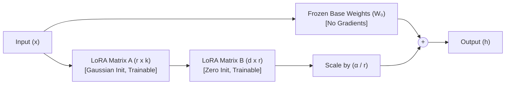

# Day 1 Deep Dive: LoRA & PEFT Fundamentals

This guide explains the core concepts, mathematical foundation, intuition, and code workflow of **Low-Rank Adaptation (LoRA)** and **Parameter-Efficient Fine-Tuning (PEFT)** as implemented in [day01_lora.ipynb](file:///e:/Downloads/Fine-tune/llm-finetuning-production/notebooks/day01_lora.ipynb).

---

## 1. Quick Reference & Key Takeaways

| Concept | Explanation | Real-World Impact |
| :--- | :--- | :--- |
| **Base Model ($W_0$)** | The pretrained foundation LLM (`Qwen2.5-1.5B`). | Fully **frozen**; 98.82% of weights never change. |
| **LoRA Adapter ($\Delta W$)** | Two low-rank matrices ($B \times A$) attached to linear layers. | Only **1.18%** (18.4M params) are trainable. |
| **Rank ($r$)** | Inner dimension / rank of the bottleneck (e.g. $r=16$). | Controls expressiveness vs parameter count. |
| **Alpha ($\alpha$)** | Constant scaling multiplier (e.g. $\alpha=32$). | Scaling factor $\frac{\alpha}{r} = 2.0$ stabilizes learning rates. |
| **Memory Reduction** | Gradients & optimizer states saved during training. | **84.6x fewer gradients**; fits consumer GPUs. |
| **Adapter Checkpoint** | Saved weights file (`adapter_model.safetensors`). | **70.49 MB** vs ~3–6 GB full model checkpoint. |

---

## 2. Intuitive Real-World Analogy

### "The 1,000-Page Encyclopedia vs. The Transparent Sticky Note"

Imagine you own a **1,000-page medical encyclopedia** (representing a 1.5B–70B parameter base LLM):

```
┌────────────────────────────────────────────────────────────────────────┐
│                        FULL FINE-TUNING                                │
│                                                                        │
│  To teach the model a new task (e.g. extracting JSON orders):         │
│  • You must reprint and rebind all 1,000 pages of the encyclopedia.    │
│  • For every word, you keep rough drafts, correction logs, and history │
│    (Optimizer States: AdamW momentum + variance = 8 bytes/param).      │
│  • Huge VRAM requirement (24 GB – 80 GB GPU).                          │
│  • High risk of "Catastrophic Forgetting" (damaging original knowledge)│
└────────────────────────────────────────────────────────────────────────┘
```

```
┌────────────────────────────────────────────────────────────────────────┐
│                     LoRA (PARAMETER-EFFICIENT)                         │
│                                                                        │
│  1. Put a protective glass cover over the book (FREEZE all 1,000 pages)│
│  2. Attach a tiny transparent sticky note on each page.                │
│  3. Only write task-specific adjustments on the sticky note pad.       │
│  • Saves 99% GPU RAM (only computing gradients for the sticky notes).  │
│  • Zero catastrophic forgetting: Base book remains 100% untouched.     │
│  • Easy to share: Distribute a 70 MB sticky note instead of 6 GB book. │
└────────────────────────────────────────────────────────────────────────┘
```

---

## 3. The Mathematics of LoRA

In standard full fine-tuning, given a pretrained weight matrix $W_0 \in \mathbb{R}^{d \times k}$, the updated weight matrix is:
$$W' = W_0 + \Delta W$$
where $\Delta W \in \mathbb{R}^{d \times k}$ has the exact same dimensions as $W_0$.

### The Low-Rank Hypothesis (Hu et al., 2021)
Task-specific adaptation has a very low **intrinsic rank** $r \ll \min(d, k)$. Therefore, the full $\Delta W$ matrix can be decomposed into the product of two skinny matrices:

$$\Delta W = \left(\frac{\alpha}{r}\right) B \cdot A$$

Where:
* $A \in \mathbb{R}^{r \times k}$ is initialized from a Gaussian random distribution $\mathcal{N}(0, \sigma^2)$.
* $B \in \mathbb{R}^{d \times r}$ is initialized to **all zeros** ($\Delta W = 0$ at step 0, preserving original pretrained behavior).
* $r$ is the **rank** (e.g., 8, 16, 32).
* $\alpha$ is a **scaling constant** (usually set to $2 \times r$).

```
                Matrix B               Matrix A
             (4096 x 16)             (16 x 4096)             Result ΔW
            ┌──┐                    ┌───────────────┐     ┌───────────────┐
            │  │                    │               │     │               │
  4096 rows │  │  16 cols     16 rows │               │  =  │  4096 x 4096  │
            │  │                    └───────────────┘     │  Full Matrix  │
            └──┘                        4096 cols         │               │
                                                          └───────────────┘
```

### Concrete Numerical Comparison
Suppose one transformer linear layer has dimensions $4096 \times 4096$:

* **Full Fine-Tuning Parameters**:
  $$4096 \times 4096 = 16,777,216 \text{ parameters (16.7 Million)}$$
* **LoRA Parameters ($r = 16$)**:
  $$\text{Matrix } A: 16 \times 4096 = 65,536$$
  $$\text{Matrix } B: 4096 \times 16 = 65,536$$
  $$\text{Total Trainable} = 65,536 + 65,536 = \mathbf{131,072} \text{ parameters}$$

$$\text{Reduction Factor} = \frac{131,072}{16,777,216} \approx \mathbf{0.78\% \text{ of original parameters!}}$$

---

## 4. Forward Pass & Zero-Latency Inference

### Forward Pass Calculation
During training and evaluation, input $x$ passes through both branches in parallel:
$$h = W_0 x + \left(\frac{\alpha}{r}\right) B A x$$



### Zero-Latency Inference (`merge_and_unload`)
In production deployment, you do not need to compute two separate matrix multiplications ($W_0 x$ and $BAx$). You can merge the adapter weights permanently into the base weights:

$$W_{\text{merged}} = W_0 + \left(\frac{\alpha}{r}\right) B A$$

Using PEFT:
```python
merged_model = peft_model.merge_and_unload()
```
This produces a single weight matrix with **zero inference latency overhead**.

---

## 5. Breakdown of Notebook Execution Results

When you execute [day01_lora.ipynb](file:///e:/Downloads/Fine-tune/llm-finetuning-production/notebooks/day01_lora.ipynb), here is what happens step by step:

### Step 1: Zero-Shot Baseline
```json
{
  "customer": "John",
  "quantity": 3,
  "product": "laptops",
  "amount": 2400.0,
  "delivery_day": "Friday"
}
```
* **Purpose**: Evaluates how well the untuned base model performs on structured JSON extraction prior to fine-tuning.

### Step 2: Parameter Inspection Output
```
============================================================
📊 PARAMETER EFFICIENCY COMPARISON
============================================================
Total Model Parameters  : 1,562,179,072
Trainable Parameters    : 18,464,768
Frozen Parameters       : 1,543,714,304
Trainable Percentage    : 1.1820%
Memory Reduction Factor : 84.6x fewer gradients
============================================================
```
* **Why 18.4M trainable parameters?** 
  Targeting 7 linear modules across all 28 transformer layers:
  `q_proj`, `k_proj`, `v_proj`, `o_proj`, `gate_proj`, `up_proj`, `down_proj`.
* **Memory impact**: In full fine-tuning of AdamW, you must store 8 bytes of optimizer states per parameter (momentum + variance in FP32) + 2–4 bytes of gradients. By training only 1.18%, the optimizer memory drops from **~18 GB down to ~220 MB**.

### Step 3: Saved Adapter Artifacts
```
models/adapters/day01_lora_test/
  ├── adapter_config.json        (0.00 MB - Hyperparameters: r, alpha, target_modules)
  ├── adapter_model.safetensors  (70.49 MB - Low-rank weight tensors A and B)
  ├── README.md
  ├── tokenizer.json             (10.89 MB - Subword token mappings)
  └── tokenizer_config.json
```
* **Why this matters**:
  Instead of copying the full ~6 GB base model for every fine-tuned task, you only distribute a **70 MB** adapter.
  A single GPU running the base model can host dozens of different adapters and swap them on the fly for multi-tenant serving.

---

## 6. Frequently Asked Interview Questions

### Q1: Why does LoRA save GPU memory if forward pass computation is the same?
**Answer**: Memory consumption during training is dominated by **optimizer states and gradients**, not just model weights. For AdamW:
* 1 parameter = 4 bytes (FP32 master weight) + 4 bytes (FP32 momentum) + 4 bytes (FP32 variance) + 2 bytes (FP16 gradient) = 14–16 bytes per trainable parameter.
* For a 1.5B model, full fine-tuning requires $\approx 24\text{ GB}$ of VRAM just for optimizer states.
* With LoRA (18.4M parameters), optimizer states require only $\approx 250\text{ MB}$.

### Q2: Why is Matrix B initialized to zeros and Matrix A to Gaussian noise?
**Answer**: If both $A$ and $B$ were initialized to Gaussian noise, $\Delta W = B \cdot A \neq 0$ at step 0, which would immediately corrupt the pretrained weights and destabilize early training. If both were initialized to zeros, gradients for both matrices would be identical (symmetry breaking issue). By setting $B=0$ and $A \sim \mathcal{N}(0, \sigma^2)$, $\Delta W = 0 \cdot A = 0$ at step 0 (preserving pretrained knowledge) while allowing non-zero gradient flow.

### Q3: How do you choose between Rank $r=8, 16, 64, 128$?
* **$r=8$ to $16$**: Optimal for structured tasks (classification, JSON extraction, NER, style transfer).
* **$r=32$ to $64$**: Best for complex reasoning, code generation, or math.
* **$r > 128$**: Higher risk of overfitting and diminishing returns; increases adapter file size without noticeable gain.
