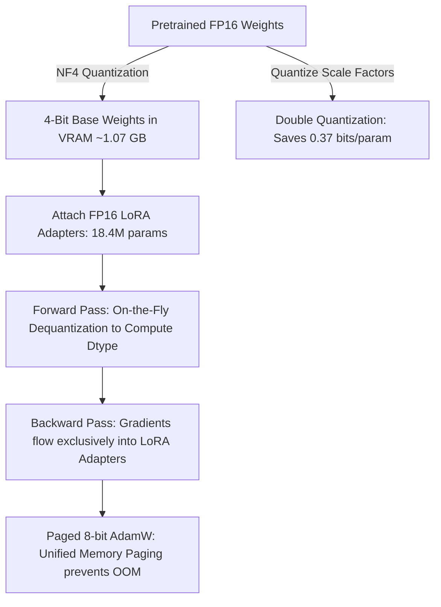

# Day 2 Deep Dive: QLoRA & 4-Bit NormalFloat Quantization

This guide provides a comprehensive breakdown of **Quantized Low-Rank Adaptation (QLoRA)**, the mathematical formulation of **NormalFloat4 (NF4)** and **Double Quantization (DQ)**, and analysis of our empirical run on the **NVIDIA Tesla T4 GPU**.

---

## 1. Quick Reference & Empirical Results

| Metric / Parameter | Value Observed on Tesla T4 | Significance & Explanation |
| :--- | :--- | :--- |
| **GPU Target** | NVIDIA Tesla T4 (14.56 GB VRAM) | Standard Google Colab free/entry GPU tier. |
| **Model** | `Qwen/Qwen2.5-1.5B-Instruct` | 1.56 Billion parameter base model. |
| **Original FP16 Weight Size** | **3.09 GB** | Size required to hold unquantized 16-bit weights. |
| **Quantized 4-Bit NF4 Weight Size** | **1,099.93 MB (~1.07 GB)** | **64.4% VRAM reduction** on base model storage. |
| **Total Model Parameters** | **1,562,179,072** | All model weights (base + LoRA). |
| **Trainable LoRA Parameters** | **18,464,768** | Only **1.1820%** of weights require gradients! |
| **Frozen Base Parameters** | **1,543,714,304** | **98.818%** of weights stay completely frozen in 4-bit. |
| **Zero-Shot Test Generation** | ✅ Valid JSON produced | Zero degradation in instruction-following ability. |

---

## 2. Intuitive Real-World Analogy

### "The Shrink-Wrapped Library Book with High-Precision Sticky Notes"

```
┌─────────────────────────────────────────────────────────────────────────────────┐
│                           STANDARD LoRA (Day 1)                                 │
│                                                                                 │
│  • The base 1,000-page book is kept in full high-resolution print (16-bit FP16).│
│  • Memory needed to keep the book open: ~3.1 GB.                                │
│  • Transparent sticky notes (LoRA adapters) attached for domain learning.       │
└─────────────────────────────────────────────────────────────────────────────────┘
```

```
┌─────────────────────────────────────────────────────────────────────────────────┐
│                           QLoRA (Day 2)                                         │
│                                                                                 │
│  1. Microfilm Compression (NF4): The 1,000-page book is compressed onto        │
│     microfilm (4-bit NormalFloat), shrinking shelf space from 3.1 GB to 1.07 GB.│
│  2. On-the-Fly Magnifier (Compute Dtype): Whenever a page is read in forward   │
│     pass, a high-speed lens dequantizes it into 16-bit just for that split-     │
│     second math operation.                                                      │
│  3. High-Precision Pen (Adapters): The sticky note pads remain in full 16-bit  │
│     precision, absorbing continuous gradient updates accurately.                │
│  4. Safety Overflow Valve (Paged Optimizers): If the desk runs out of room,    │
│     optimizer pages automatically spill to CPU memory rather than crashing.     │
└─────────────────────────────────────────────────────────────────────────────────┘
```

---

## 3. The Three Core Innovations of QLoRA (*Dettmers et al., 2023*)



### 1. NormalFloat4 (NF4) vs. Uniform INT4
Pretrained neural network weights are not uniformly distributed; they follow a zero-mean normal distribution:
$$W \sim \mathcal{N}(0, \sigma^2)$$

* **Uniform INT4**: Splits the range $[-1, 1]$ into 16 equal-width intervals. This results in many bins near the tails containing almost zero weights, while the dense center has high quantization error.
* **NormalFloat4 (NF4)**: Finds 16 quantile points $q_i$ such that:
$$P(q_i \le X \le q_{i+1}) = \frac{1}{16} \quad \text{for all } i \in [0, 15]$$
Every single bin has equal probability mass, minimizing theoretical information entropy loss.

### 2. Double Quantization (DQ)
In block-wise quantization with block size $B_1 = 64$, every block requires an FP32 scale factor $c_1$:
$$\text{Memory Overhead} = \frac{32 \text{ bits}}{64 \text{ parameters}} = 0.5 \text{ bits/param}$$

Double Quantization treats these $c_1$ constants as a second tensor and quantizes them into 8-bit FP8 with block size $B_2 = 256$ and scale factor $c_2$:
$$\text{Memory Overhead}_{\text{DQ}} = \frac{8 \text{ bits}}{64} + \frac{32 \text{ bits}}{64 \times 256} \approx 0.125 + 0.002 = 0.127 \text{ bits/param}$$
$$\text{Savings} = 0.5 - 0.127 = 0.373 \text{ bits/param}$$
On a 1.5B model, this saves **~70 MB** of VRAM; on a 70B model, this saves over **3.2 GB** of pure scale constant overhead!

### 3. Paged Optimizers
Uses NVIDIA CUDA Unified Memory drivers. If activation memory surges during long-context forward passes, non-critical optimizer state pages are swapped to CPU host RAM and paged back seamlessly, preventing out-of-memory crashes.

---

## 4. Understanding the Execution Numbers

### A. Base Weight Compression
$$\text{Unquantized FP16} \approx 1.56 \times 10^9 \text{ params} \times 2 \text{ bytes} \approx 3.12 \text{ GB}$$
$$\text{Quantized 4-Bit NF4} \approx 1.56 \times 10^9 \times 0.5 \text{ bytes} + \text{LayerNorms/Embeddings} \approx 1.07 \text{ GB}$$
$$\text{Observed}: 1,099.93 \text{ MB} \quad (\approx 64.4\% \text{ reduction})$$

### B. Parameter Breakdown
* **Total Parameters**: `1,562,179,072`
* **Trainable Parameters**: `18,464,768` ($1.1820\%$)
* **Targeted Modules**:
  * Attention projections: `q_proj`, `k_proj`, `v_proj`, `o_proj`
  * MLP projections: `gate_proj`, `up_proj`, `down_proj`

---

## 5. Summary of Key Interview Questions

1. **Why do we need `bnb_4bit_compute_dtype` if the model is loaded in 4-bit?**
   > Base weights are stored in 4-bit to save VRAM, but GPU tensor cores perform matrix multiplications ($\mathbf{X} \cdot \mathbf{W}$) in 16-bit (`bfloat16` or `float16`). BitsAndBytes dequantizes weights on-the-fly into `compute_dtype` during the forward pass.
2. **What happens during backpropagation in QLoRA?**
   > Gradients flow backwards through the dequantized weights without modifying them. The gradients are computed and accumulated strictly for the FP16/BF16 LoRA adapter matrices ($A$ and $B$).
3. **What is the purpose of `prepare_model_for_kbit_training()`?**
   > It casts non-quantized layers (such as LayerNorm and LayerNorm biases) into full `float32` precision to avoid underflow/overflow numerical instabilities during training, and enables input gradient hooks for gradient checkpointing.
