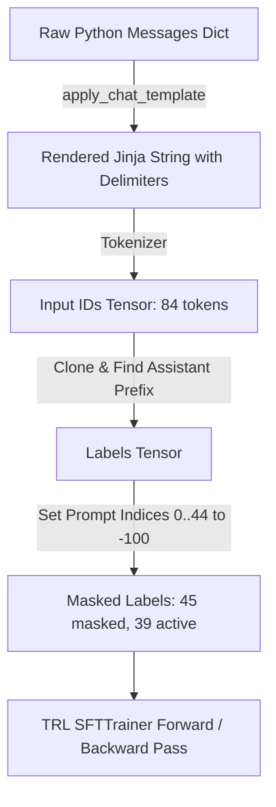

# Day 3 Deep Dive: Supervised Fine-Tuning (SFT), ChatML & Loss Masking

This guide provides a comprehensive breakdown of **Supervised Fine-Tuning (SFT)**, **ChatML formatting (`<|im_start|>`, `<|im_end|>`)**, and the mathematical mechanics of **Assistant Response Loss Masking (`labels = -100`)**.

---

## 1. Quick Reference & Day 3 Empirical Results

| Metric / Parameter | Value Observed | Significance & Explanation |
| :--- | :--- | :--- |
| **Model Tokenizer** | `Qwen/Qwen2.5-1.5B-Instruct` | Fast BPE tokenizer with structured control tokens. |
| **Vocabulary Size** | `151,643` | Comprehensive multi-lingual and code/token vocabulary. |
| **EOS Stop Token** | `<|im_end|>` (ID: `151645`) | Model emits this single token to terminate generation immediately after `}`. |
| **Total Sequence Length** | **84 tokens** | Combined prompt + target completion. |
| **Masked Prompt Tokens** | **45 tokens (53.57%)** | System prompt & user request masked with `labels = -100` (Zero loss). |
| **Active Gradient Tokens** | **39 tokens (46.43%)** | Target JSON completion where $\nabla_\theta \mathcal{L}$ is computed. |
| **Dataset Format** | Hugging Face `Dataset` | Ready for direct ingestion into `TRL`'s `SFTTrainer`. |

---

## 2. Intuitive Real-World Analogy

### "The Exam Student vs. The Over-Memorizing Scribe"

```
┌─────────────────────────────────────────────────────────────────────────────────┐
│                    UNMASKED SFT (The Over-Memorizing Scribe)                    │
│                                                                                 │
│  • The student is graded on copying the exam question AND writing the answer.   │
│  • Result: The student spends half their energy memorizing how the professor    │
│    phrased the question rather than mastering how to solve the problem.        │
└─────────────────────────────────────────────────────────────────────────────────┘
```

```
┌─────────────────────────────────────────────────────────────────────────────────┐
│                    MASKED SFT (The Focused Exam Student - Day 3)                │
│                                                                                 │
│  1. Ignore Index (-100): The professor's question is marked "do not grade".     │
│  2. 100% Focused Evaluation: The student is graded ONLY on the structured       │
│     JSON answer they write in response to the question.                         │
│  3. Exact Stopping: The student is taught to put down their pencil immediately  │
│     after writing the final closing bracket (<|im_end|>).                       │
└─────────────────────────────────────────────────────────────────────────────────┘
```

---

## 3. The Mathematics of SFT & Loss Masking

### A. The Auto-Regressive Causal LM Objective
In causal language modeling, the probability of a sequence $X = (x_1, x_2, \dots, x_N)$ is factored auto-regressively:
$$P(X; \theta) = \prod_{t=1}^{N} P(x_t \mid x_1, x_2, \dots, x_{t-1}; \theta)$$

The cross-entropy loss over the entire sequence is:
$$\mathcal{L}_{\text{full}} = -\frac{1}{N} \sum_{t=1}^{N} \log P(x_t \mid x_{<t}; \theta)$$

### B. Why Unmasked SFT Harms Downstream Performance
If tokens $1 \dots K$ represent the prompt (system message + user input) and tokens $K+1 \dots N$ represent the target completion:
$$\mathcal{L}_{\text{full}} = \underbrace{-\frac{1}{N}\sum_{t=1}^{K} \log P(x_t \mid x_{<t}; \theta)}_{\text{Loss on Prompt (Noisy)}} + \underbrace{-\frac{1}{N}\sum_{t=K+1}^{N} \log P(x_t \mid x_{<t}; \theta)}_{\text{Loss on Target Response (Signal)}}$$

Computing loss on the prompt introduces gradient noise because:
1. User prompt phrasing varies randomly across samples.
2. The model consumes parameter capacity learning to predict the prompt rather than learning to generate the output conditioned on the prompt.

### C. Masked SFT Loss Formulation
By assigning `labels[1:K] = -100`:
$$\mathcal{L}_{\text{SFT}} = -\frac{1}{N - K} \sum_{t=K+1}^{N} \log P(x_t \mid x_{<t}; \theta)$$

In PyTorch, `torch.nn.CrossEntropyLoss(ignore_index=-100)` ignores all $-100$ indices during both the forward pass (accumulated loss) and backward pass (gradient backpropagation).

---

## 4. ChatML Formatting & Token Flow



### Breakdown of Rendered Tokens
* **System Tokens**: `<|im_start|>system\nYou are an expert entity extraction system...<|im_end|>\n`
* **User Tokens**: `<|im_start|>user\nJohn ordered 3 laptops for $2400...<|im_end|>\n`
* **Assistant Header**: `<|im_start|>assistant\n` *(End of Prompt: Token 45)*
* **Active Target Tokens**: `{"customer": "John", ...}<|im_end|>` *(Tokens 46 to 84)*

---

## 5. Master Interview Questions & Answers

### Q1: What is the purpose of `add_generation_prompt=True` in `apply_chat_template`?
> **Answer**: `add_generation_prompt=True` appends the assistant start delimiter (`<|im_start|>assistant\n`) to the end of the prompt without closing it. During inference, this primes the model to begin generating tokens as the assistant role immediately. During loss masking, it marks the exact boundary where prompt tokens end and target response tokens begin.

### Q2: Why is the EOS token (`<|im_end|>`) included in the active gradient slice?
> **Answer**: If the end-of-sequence token is masked with `-100`, the model receives zero gradient signal for emitting it. Consequently, during inference, the model will output the correct JSON but will not know when to stop, leading to conversational runaway, hallucinations, or hitting `max_new_tokens`.

### Q3: How does `DataCollatorForCompletionOnlyLM` work in Hugging Face TRL?
> **Answer**: It takes the tokenized batch and dynamically scans the `input_ids` for the byte sub-sequence matching a user-specified `response_template` (e.g. `"<|im_start|>assistant\n"`). It sets all preceding token positions in the `labels` tensor to `-100`, automating response loss masking across variable-length batches.
