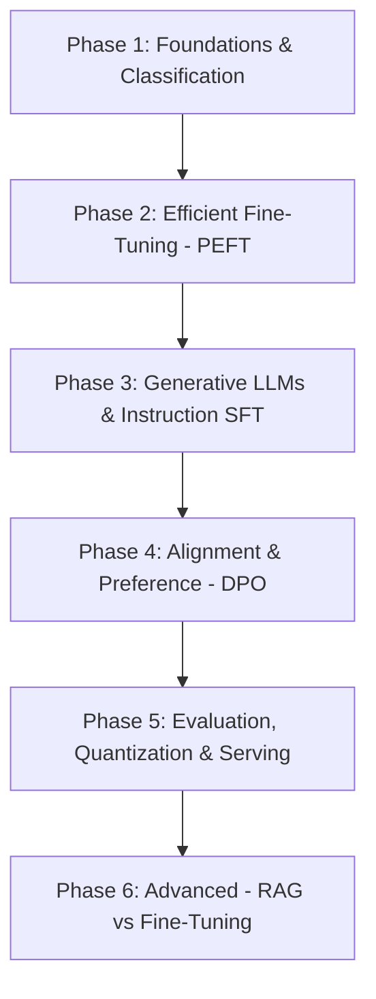

# Fine-Tuning Proof-of-Concept (PoC) Learning Roadmap

This document outlines a structured, step-by-step roadmap of **Proof of Concepts (PoCs)** designed to help master fine-tuning techniques—from basic text classification up to Parameter-Efficient Fine-Tuning (PEFT), Instruction Tuning (SFT), Preference Alignment (DPO), and local model deployment.

---

## 🎯 Learning Objectives
By completing these PoCs, you will understand:
1. **How models learn**: Full fine-tuning vs. Parameter-Efficient Fine-Tuning (PEFT).
2. **Data preparation**: Formatting datasets for classification, chat, and preference alignment.
3. **Hardware & Memory Optimization**: LoRA, QLoRA (4-bit/8-bit quantization), gradient checkpointing, and dynamic padding.
4. **Alignment**: Moving from base models $\rightarrow$ Instruction models (SFT) $\rightarrow$ Aligned models (DPO/RLHF).
5. **Evaluation & Serving**: LLM-as-a-Judge, merging adapters, and deploying with GGUF/vLLM.

---

## 🗺️ The PoC Progression Roadmap

---

## 📌 Phase 1: Foundations & Classification Baseline (Current Phase)

| PoC ID | PoC Name | Tech Stack | Key Concepts Learned |
| :--- | :--- | :--- | :--- |
| **PoC 1.1** | **Classical ML vs. Full Encoder Fine-Tuning** *(Completed)* | `scikit-learn`, `HuggingFace Transformers`, `DistilBERT` | TF-IDF vs. Subword embeddings, Softmax logits, Trainer API, serialization. |
| **PoC 1.2** | **Multi-Class & Multi-Label Classification** | `BERT` / `RoBERTa`, `BCEWithLogitsLoss` | Classification heads, sigmoid multi-label thresholding, handling class imbalance (weighted loss). |
| **PoC 1.3** | **Tokenization & Custom Vocabulary** | `AutoTokenizer`, `tokenizers` | Special tokens (`[CLS]`, `[SEP]`, `<pad>`), subword tokenizers (BPE / WordPiece), adding custom tokens without corrupting embeddings. |

---

## 📌 Phase 2: Parameter-Efficient Fine-Tuning (PEFT)

| PoC ID | PoC Name | Tech Stack | Key Concepts Learned |
| :--- | :--- | :--- | :--- |
| **PoC 2.1** | **LoRA (Low-Rank Adaptation) from Scratch & PEFT** | `peft`, `torch`, `RoBERTa` / `Mistral` | Low-rank matrices ($W = W_0 + \frac{\alpha}{r} AB$), frozen base weights, rank ($r$) & alpha ($\alpha$) tuning, target modules (`q_proj`, `v_proj`). |
| **PoC 2.2** | **QLoRA (4-bit Quantized LoRA)** | `bitsandbytes`, `peft`, `accelerate` | NormalFloat4 (NF4) quantization, double quantization, paged optimizers, fine-tuning 7B models on 16GB GPU memory (e.g. Colab / T4). |
| **PoC 2.3** | **Prompt Tuning & Prefix Tuning vs. LoRA** | `peft` | Soft prompts, virtual token length vs. adapter parameter efficiency, performance comparisons. |

---

## 📌 Phase 3: Generative LLMs & Instruction Tuning (SFT)

| PoC ID | PoC Name | Tech Stack | Key Concepts Learned |
| :--- | :--- | :--- | :--- |
| **PoC 3.1** | **Supervised Fine-Tuning (SFT) for Chat** | `TRL (SFTTrainer)`, `Llama-3` / `Qwen-2.5` | ChatML prompt templates, instruction formatting (`<\|im_start\|>`), loss masking (calculating loss only on assistant responses, ignoring prompt tokens). |
| **PoC 3.2** | **Domain-Specific Task Fine-Tuning (e.g., Text-to-SQL or JSON Extraction)** | `TRL`, `datasets`, `unsloth` | Structuring dataset targets for JSON/SQL schemas, zero-shot evaluation before vs. after fine-tuning. |
| **PoC 3.3** | **Continued Pre-training / Domain Adaptation** | `Transformers (DataCollatorForLanguageModeling)` | Unsupervised Causal LM (CLM) on raw domain documents (medical, legal, financial) prior to SFT. |

---

## 📌 Phase 4: Preference Optimization & Alignment (DPO / RLHF)

| PoC ID | PoC Name | Tech Stack | Key Concepts Learned |
| :--- | :--- | :--- | :--- |
| **PoC 4.1** | **Direct Preference Optimization (DPO)** | `TRL (DPOTrainer)`, `peft` | Pairwise preference datasets (`prompt`, `chosen`, `rejected`), implicit reward functions, $\beta$ hyperparameter control. |
| **PoC 4.2** | **Monolithic Alignment (ORPO / KTO)** | `TRL (ORPOTrainer)` | Single-step SFT + Preference Alignment (eliminates the need for reference models in memory). |
| **PoC 4.3** | **Reward Modeling & PPO Overview** | `TRL (PPOTrainer)` | Value heads, policy gradients, KL divergence penalty against base model drift. |

---

## 📌 Phase 5: Evaluation, Quantization & Serving

| PoC ID | PoC Name | Tech Stack | Key Concepts Learned |
| :--- | :--- | :--- | :--- |
| **PoC 5.1** | **LLM Evaluation Pipeline** | `lm-evaluation-harness`, `ragas`, `DeBERTa` | Automated metrics (ROUGE, BLEU, Perplexity) vs. LLM-as-a-Judge (GPT-4 / Local Judge scoring). |
| **PoC 5.2** | **LoRA Merging & Exporting** | `peft`, `transformers` | Merging adapter weights back into base model (`merge_and_unload`), saving standalone weights for zero-overhead inference. |
| **PoC 5.3** | **GGUF Conversion & Local Serving** | `llama.cpp`, `vLLM`, `ollama` | GGUF quantization (Q4_K_M, Q8_0), hosting fine-tuned models via vLLM or Ollama for local API access. |

---

## 📌 Phase 6: Advanced Topics & Comparative Architectures

| PoC ID | PoC Name | Tech Stack | Key Concepts Learned |
| :--- | :--- | :--- | :--- |
| **PoC 6.1** | **Catastrophic Forgetting & Anti-Forgetting Mitigation** | Custom Trainer | Testing general knowledge benchmark loss after domain fine-tuning; dataset replay mixing strategies. |
| **PoC 6.2** | **Fine-Tuning vs. RAG vs. RAFT (Retrieval-Augmented Fine-Tuning)** | `LlamaIndex` / `LangChain`, `peft` | Comparing (1) Base Model + RAG vs. (2) Fine-Tuned Model vs. (3) RAFT (Fine-tuning model to read retrieved context). |

---

## 🛠️ Recommended Setup & Tools

- **Frameworks**: PyTorch, Hugging Face (`transformers`, `peft`, `trl`, `datasets`, `accelerate`), Unsloth.
- **Hardware**: Local GPU (NVIDIA 8GB-24GB) or Cloud (Google Colab T4/A100, Kaggle, Modal, RunPod).
- **Tracking & Logging**: Weights & Biases (`wandb`) or TensorBoard for monitoring loss curves, learning rate warmups, and GPU memory utilization.

---

## 💡 Quick-Start Suggestion for Next PoC
Since **PoC 1.1** (DistilBERT sentiment fine-tuning & baseline ML) is already implemented in this repository:
1. **Next Logical Step**: Move to **PoC 2.1 (LoRA from Scratch & PEFT)** on a small classification model or generative model to see parameter efficiency in action.
2. **Alternative Step**: Move to **PoC 3.1 (Instruction Fine-Tuning using SFTTrainer)** with a small 1B/3B LLM (e.g. `Qwen2.5-1.5B` or `Llama-3.2-1B`) on a free T4 GPU.
