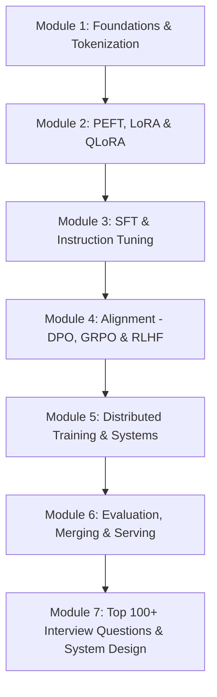

# 🎯 Fine-Tuning A to Z: Master Interview & Engineering Guide

Welcome to the **Comprehensive Fine-Tuning A to Z Interview Guide**. This guide is designed for **Machine Learning Engineers, Senior AI Engineers, LLM Researchers, and Applied Scientists** preparing for technical interviews, system design rounds, and real-world production fine-tuning challenges.

---

## 🗺️ Master Curriculum & Study Path

---

## 📚 Guide Modules & Table of Contents

| Module | Document Link | Key Topics Covered |
| :--- | :--- | :--- |
| **01** | [**Foundations & Tokenization**](01_foundations_and_tokenization.md) | Tokenizers (BPE, WordPiece, Byte-level), Custom Vocab expansion, Loss masking (`labels=-100`), Causal Attention, RoPE context scaling, Embedding layer math. |
| **02** | [**PEFT: LoRA, QLoRA & Beyond**](02_peft_lora_and_qlora.md) | LoRA mathematical derivation ($W_0 + \frac{\alpha}{r}BA$), Intrinsic rank hypothesis, QLoRA (NF4, Double Quant, Paged Optimizers), DoRA, AdaLoRA, VRAM formulas. |
| **03** | [**Instruction Tuning & SFT**](03_instruction_tuning_and_sft.md) | ChatML/ShareGPT templates, Loss masking mechanics, Synthetic data (Self-Instruct, Evol-Instruct), Deduplication (SemDeDup, MinHash), LR schedules, Catastrophic forgetting. |
| **04** | [**Preference Alignment & RL (DPO / GRPO)**](04_preference_alignment_dpo_grpo_rlhf.md) | Classic RLHF (Reward Model + PPO), DPO derivation from Bradley-Terry, KTO, ORPO, SimPO, GRPO (DeepSeek-R1 reasoning & critic-free RL), PRMs vs ORMs. |
| **05** | [**Distributed Training & Systems**](05_distributed_training_and_scale.md) | ZeRO 1/2/3, FSDP, 3D Parallelism (TP, PP, DP, CP), Ring-AllReduce math, FlashAttention-2/3 SRAM tiling, Activation Checkpointing, Mixed Precision (BF16 vs FP16 vs FP8). |
| **06** | [**Evaluation, Merging & Serving**](06_evaluations_merging_and_serving.md) | LLM-as-a-Judge rubrics, Automated benchmarks (MMLU, GSM8K, MT-Bench), Model Merging (SLERP, TIES, DARE), Quantization (AWQ, GPTQ, GGUF), vLLM & PagedAttention, Multi-LoRA serving. |
| **07** | [**100+ Interview Questions & Scenarios**](07_top_100_interview_questions_and_scenarios.md) | 100+ Tier-1 Tech Interview Questions (FAANG, OpenAI, Anthropic-level), PyTorch coding implementations from scratch, debugging failure modes, and System Design architectures. |

---

## ⚡ Quick-Reference Formula Cheat Sheet

### 1. LoRA Adaptation
$$W = W_0 + \Delta W = W_0 + \frac{\alpha}{r} (B \cdot A)$$
* $W_0 \in \mathbb{R}^{d \times k}$, $B \in \mathbb{R}^{d \times r}$, $A \in \mathbb{R}^{r \times k}$ where $r \ll \min(d, k)$.
* Initialization: $A \sim \mathcal{N}(0, \sigma^2)$, $B = 0$ $\implies \Delta W = 0$ at step 0.

### 2. DPO Objective Function
$$\mathcal{L}_{\text{DPO}}(\theta; \pi_{\text{ref}}) = -\mathbb{E}_{(x, y_w, y_l) \sim \mathcal{D}} \left[ \log \sigma \left( \beta \log \frac{\pi_\theta(y_w \mid x)}{\pi_{\text{ref}}(y_w \mid x)} - \beta \log \frac{\pi_\theta(y_l \mid x)}{\pi_{\text{ref}}(y_l \mid x)} \right) \right]$$

### 3. GRPO Group Normalized Advantage (DeepSeek-R1)
$$A_i = \frac{r_i - \text{mean}(\{r_1, \dots, r_G\})}{\text{std}(\{r_1, \dots, r_G\})}$$

### 4. GPU VRAM Consumption for Full Fine-Tuning (AdamW + FP16/BF16)
$$\text{Memory per Parameter} = 2 \text{ bytes (Weights)} + 2 \text{ bytes (Gradients)} + 12 \text{ bytes (AdamW: FP32 master + momentum + variance)} = 16 \text{ bytes/param}$$
* For a 7B model: $7 \times 10^9 \times 16 \text{ bytes} \approx 112\text{ GB}$ (excluding activations and KV cache).
* With **QLoRA (4-bit base + LoRA)**: Base weights $\approx 3.5\text{ GB}$, LoRA params $\approx 50\text{ MB}$, Total VRAM $\approx 6\text{–}8\text{ GB}$.

---

## 🎯 How to Use This Guide for Interviews

1. **For Screening Rounds (Recruiter / Hiring Manager / Junior MLE)**: Focus on [Module 01](01_foundations_and_tokenization.md), [Module 02](02_peft_lora_and_qlora.md), and the Concept Flashcards in [Module 07](07_top_100_interview_questions_and_scenarios.md).
2. **For Deep-Dive Technical Rounds (Senior / Staff AI Engineer)**: Master the mathematical derivations in [Module 02](02_peft_lora_and_qlora.md) & [Module 04](04_preference_alignment_dpo_grpo_rlhf.md), as well as the distributed memory breakdown in [Module 05](05_distributed_training_and_scale.md).
3. **For Machine Learning System Design (MLSD)**: Study the end-to-end architectures in [Module 06](06_evaluations_merging_and_serving.md) and the System Design Scenarios in [Module 07](07_top_100_interview_questions_and_scenarios.md).
