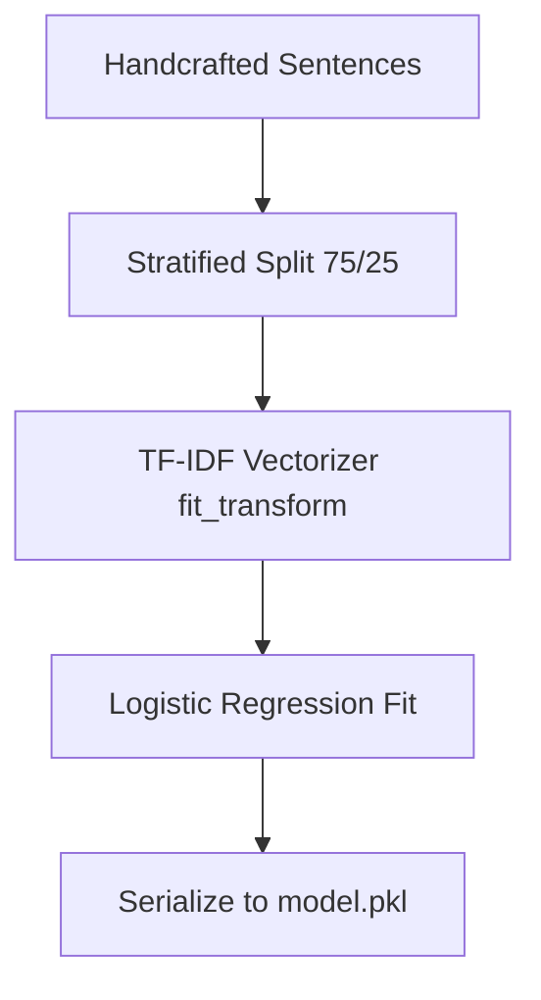
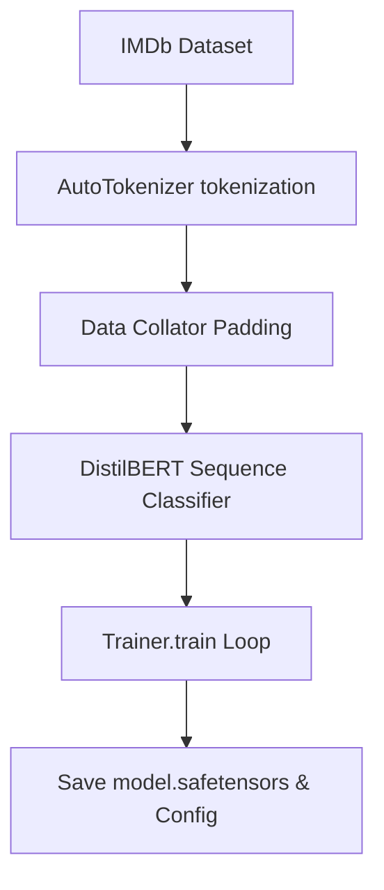

# Sentiment Classification Pipelines Deep Dive

This document provides a deep dive into the inner workings of both the **Simple ML (Logistic Regression)** and **Deep Learning (DistilBERT)** sentiment classification pipelines implemented in this repository.

---

## 1. Classical ML: TF-IDF + Logistic Regression
Implemented in:
*   [train_simple_sentiment.py](file:///e:/Downloads/Fine-tune/distilbert-base-uncased/train_simple_sentiment.py) (Training & model building)
*   [predict_simple.py](file:///e:/Downloads/Fine-tune/distilbert-base-uncased/predict_simple.py) (Inference script)
*   [inspect_model.py](file:///e:/Downloads/Fine-tune/distilbert-base-uncased/inspect_model.py) (Quick verification script)



### A. Data Pre-processing & Feature Extraction
*   **Dataset:** A manually defined set of 32 sentences (16 positive, 16 negative).
*   **Splitting:** The script uses `train_test_split` with `stratify=labels`. Since the dataset is extremely small, stratification is critical to guarantee that the $75\%$ training split and $25\%$ testing split both receive an exact $50/50$ ratio of positive and negative examples.
*   **Vectorization:** [TfidfVectorizer](file:///e:/Downloads/Fine-tune/distilbert-base-uncased/train_simple_sentiment.py#L65) transforms raw text strings into numerical vectors. 
    *   It uses term frequency-inverse document frequency (TF-IDF), which scales down the weight of common grammatical words (like "the", "was") and scales up unique sentiment words (like "fantastic", "dull").
    *   It specifies `ngram_range=(1, 2)`. This means it extracts single words ("loved") and two-word sequences ("not recommend"). Capturing bigrams is crucial for capturing negations.

### B. Training & Serialization
*   **Model:** A standard [LogisticRegression](file:///e:/Downloads/Fine-tune/distilbert-base-uncased/train_simple_sentiment.py#L69) classifier, which calculates a weighted sum of the TF-IDF features and passes it through a sigmoid function to output a probability between 0 and 1.
*   **The Serialization Gotcha:** To perform inference later, raw input text must be converted into the exact same vector space (with the same vocabulary indices) that the model was trained on. To achieve this, the script pickles **both** the vectorizer and the model as a tuple:
    ```python
    with open(output_path / "model.pkl", "wb") as fh:
        pickle.dump((vectorizer, model), fh)
    ```
*   **Inference:** When predicting, it loads this tuple, applies the loaded vectorizer's `.transform()` to the new text, and runs `.predict_proba()` to retrieve class probabilities.

---

## 2. Deep Learning: DistilBERT Fine-Tuning
Implemented in:
*   [train_sentiment.py](file:///e:/Downloads/Fine-tune/distilbert-base-uncased/train_sentiment.py) (Fine-tuning pipeline)
*   [predict.py](file:///e:/Downloads/Fine-tune/distilbert-base-uncased/predict.py) (Inference script)



### A. Reproducibility
*   [set_global_seed](file:///e:/Downloads/Fine-tune/distilbert-base-uncased/train_sentiment.py#L22) locks the random states for Python's `random`, `numpy`, and PyTorch (`torch.manual_seed` and CUDA seeds). This ensures that weights initialization in the final classification head and dataset shuffling are reproducible.

### B. Dataset Loading & Fallback
*   The script attempts to download the standard IMDb movie review dataset (25,000 training, 25,000 test samples) using Hugging Face's `datasets`.
*   If the network is offline or the download fails, it catches the exception and falls back to generating a synthetic dataset of 12 reviews, split 80/20 into train/validation sets using HF's `Dataset.from_list`.

### C. Tokenization
*   Unlike the simple TF-IDF space, deep learning models require sub-word tokenization. The [AutoTokenizer](file:///e:/Downloads/Fine-tune/distilbert-base-uncased/train_sentiment.py#L95) converts text into:
    *   `input_ids`: A sequence of integers mapping words/sub-words to DistilBERT's dictionary.
    *   `attention_mask`: A sequence of 1s and 0s telling the model which tokens are actual text vs. padding tokens.
*   Tokenization is batched using `dataset.map` with `truncation=True` and a maximum length of 128 to save memory.

### D. The Architecture and Fine-Tuning Process
*   **The Model:** [AutoModelForSequenceClassification](file:///e:/Downloads/Fine-tune/distilbert-base-uncased/train_sentiment.py#L98) loads the pretrained `distilbert-base-uncased` base. 
*   **The Classification Head:** Because the base model was trained on masked language modeling (predicting missing words), Hugging Face discards the pre-training head and appends a fresh, randomly initialized linear classification layer. The size of this layer maps from the hidden size of the transformer (768 dimensions) to our target number of labels (2: positive/negative).
*   **Data Collator:** `DataCollatorWithPadding` dynamically pads the tensors in each batch to the length of the longest sequence *within that specific batch* rather than padding everything globally to 128. This speeds up GPU/CPU computation.
*   **Optimization Loop:**
    *   The `Trainer` runs backpropagation. Only the classification head starts with random weights; the transformer layers already contain rich linguistic understanding from pre-training.
    *   During training, gradients flow backward through the head and down into the DistilBERT layers, adapting the existing weights to target the sentiment task (a process called *full fine-tuning*).
    *   The script saves only the best-performing model checkpoint on validation accuracy (`load_best_model_at_end=True`).

### E. Predictions
For inference ([predict.py](file:///e:/Downloads/Fine-tune/distilbert-base-uncased/predict.py)), the script:
1. Tokenizes the input text.
2. Passes it to the model inside a `torch.no_grad()` context (disabling gradient calculations to save memory and compute).
3. Takes the raw model outputs (called **logits**) and passes them through a Softmax function:
   $$\text{Softmax}(x_i) = \frac{e^{x_i}}{\sum_j e^{x_j}}$$
   This normalizes the logits into a valid probability distribution summing to 1.
4. Takes the `argmax` of these probabilities to determine the predicted label.
