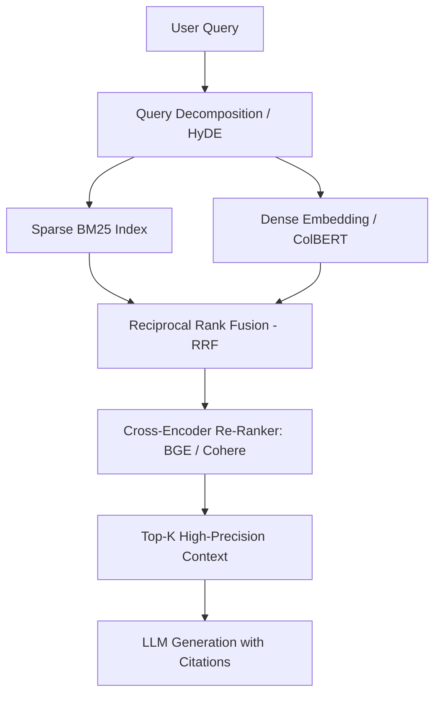
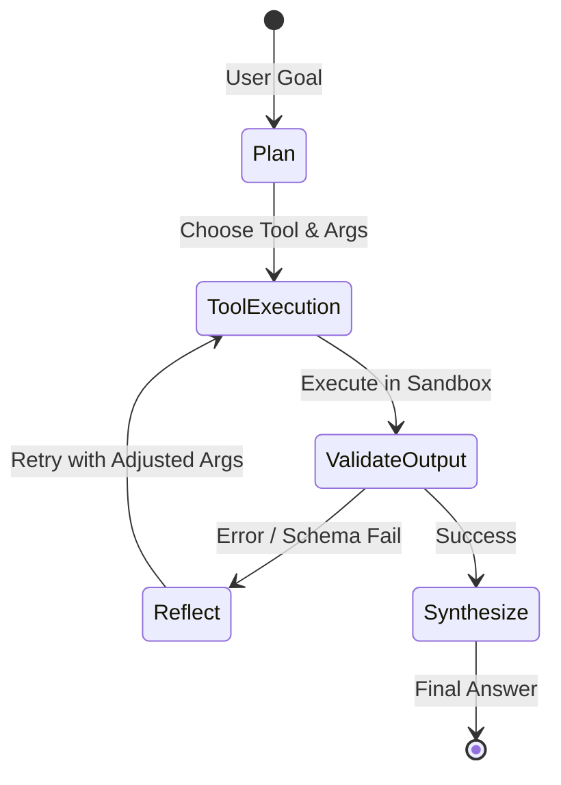

# The Senior AI Engineer's Production Handbook: Beyond Fine-Tuning

A comprehensive, production-grade architectural guide covering advanced systems engineering, alignment algorithms, high-throughput inference, distributed GPU infrastructure, agentic orchestration, and industrial LLMOps.

---

## 🗺️ The Senior AI Engineer Competency Map

```
                                  SENIOR AI ENGINEER KNOWLEDGE STACK
                                                  │
         ┌────────────────────────┬───────────────┴───────────────┬────────────────────────┐
         ▼                        ▼                               ▼                        ▼
     PILLAR 1                 PILLAR 2                        PILLAR 3                 PILLAR 4
[Post-Training &         [Distributed GPU               [High-Throughput        [Advanced RAG &
 Preference Alignment]   Systems & Parallelism]         Inference & Serving]    Knowledge Graphs]
 • DPO / IPO / KTO       • DeepSpeed ZeRO-1/2/3         • vLLM / SGLang         • Hybrid Search (RRF)
 • GRPO (DeepSeek-R1)    • PyTorch FSDP / FSDP2         • PagedAttention        • ColBERT Multi-Vector
 • Process Reward Models • 3D Parallelism (TP/PP/CP)    • Speculative Decoding  • GraphRAG (Neo4j)
 • Test-Time Search/MCTS • FlashAttention-2/3 & Triton  • FP8 / AWQ / Marlin    • Corrective RAG (CRAG)
         │                        │                               │                        │
         └────────────────────────┼───────────────────────────────┴────────────────────────┘
                                  ▼
         ┌────────────────────────┼───────────────────────────────┐
         ▼                        ▼                               ▼
     PILLAR 5                 PILLAR 6                        PILLAR 7
[Autonomous Multi-       [Synthetic Data &               [Industrial LLMOps,
 Agent Systems]           Knowledge Distillation]         Evals & Security]
 • LangGraph Cyclic State • Teacher-Student Distill       • Ragas & lm-eval-harness
 • Model Context Protocol • Evol-Instruct & Self-Instruct • LLM-as-a-Judge Rubrics
 • Constrained Decoding   • MinHash & SemDeDup Curation   • Langfuse Observability
 • Tool Calling Sandboxes • Rejection Sampling (Deduce)   • Guardrails & Injection
```

---

## 1. Pillar 1: Advanced Post-Training & Preference Alignment

Fine-tuning (SFT) teaches a model **what to format**; alignment and reinforcement learning teach a model **how to reason, generalize, and stay safe**.

```
┌──────────────────────────────────────────────────────────────────────────────────────────┐
│                               POST-TRAINING PROGRESSION                                  │
│                                                                                          │
│  [Pretrained Base] ──► [Supervised Fine-Tuning] ──► [Preference Alignment] ──► [RL / Reasoning]│
│   (Next-token web)       (Instruction following)       (DPO / KTO / IPO)        (GRPO / PRMs)   │
└──────────────────────────────────────────────────────────────────────────────────────────┘
```

### A. Direct Preference Optimization (DPO) vs. Classic RLHF
* **Classic RLHF (PPO)**: Requires training an explicit Reward Model $R_\psi(x, y)$, computing KL divergence against a reference model $\pi_{\text{ref}}$, and running complex Actor-Critic policy gradient loops in GPU memory.
* **DPO (*Rafailov et al., 2023*)**: Mathematically reparameterizes the reward function in terms of the policy itself:
  $$r(x, y) = \beta \log \frac{\pi_\theta(y \mid x)}{\pi_{\text{ref}}(y \mid x)}$$
  This yields a simple, stable binary cross-entropy loss over pairwise preference pairs $(y_w \succ y_l)$:
  $$\mathcal{L}_{\text{DPO}}(\theta) = -\mathbb{E}_{(x, y_w, y_l)} \left[ \log \sigma \left( \beta \log \frac{\pi_\theta(y_w \mid x)}{\pi_{\text{ref}}(y_w \mid x)} - \beta \log \frac{\pi_\theta(y_l \mid x)}{\pi_{\text{ref}}(y_l \mid x)} \right) \right]$$
* **KTO (Kahneman-Tversky Optimization)**: Operates on unpaired binary feedback (thumbs up / thumbs down) instead of strict pairwise comparisons, mimicking human prospect theory.

### B. Group Relative Policy Optimization (GRPO) — The DeepSeek-R1 Paradigm
* Traditional PPO requires a Value Model (Critic) occupying equal memory to the Policy Actor.
* **GRPO** eliminates the Critic model entirely. For each prompt $q$, it samples a group of $G$ candidate outputs $\{o_1, o_2, \dots, o_G\}$ and computes rewards using **verifiable rules** (e.g., Python compiler pass/fail, exact math verification):
  $$A_i = \frac{r_i - \text{mean}(\{r_1 \dots r_G\})}{\text{std}(\{r_1 \dots r_G\})}$$
* **Impact**: Slashes training VRAM by ~50% and drives emergent long-chain-of-thought (CoT) reasoning behaviors.

### C. Process Reward Models (PRMs) vs. Outcome Reward Models (ORMs)
* **ORM**: Scores only the final answer at the end of generation (prone to reward hacking and false positives through flawed reasoning).
* **PRM**: Assigns a step-level reward $r_t$ to every individual logical deduction step in the chain of thought, enabling test-time search algorithms like **Monte Carlo Tree Search (MCTS)** and **Beam Search**.

---

## 2. Pillar 2: Distributed GPU Systems & Parallelism

When scaling training beyond a single GPU, senior engineers must orchestrate memory and compute across nodes without communication bottlenecks.

```
┌──────────────────────────────────────────────────────────────────────────────────────────┐
│                                 3D PARALLELISM DIMENSIONS                                │
│                                                                                          │
│  1. Tensor Parallelism (TP):   Split matrix columns/rows across GPUs (within NVLink node)│
│  2. Pipeline Parallelism (PP): Split transformer layers across nodes (Micro-batched)     │
│  3. Data Parallelism (DP):     Replicate model, shard data batches (FSDP / ZeRO-3)       │
│  4. Context Parallelism (CP):  Split long sequence lengths (128k+) across GPUs           │
└──────────────────────────────────────────────────────────────────────────────────────────┘
```

### A. DeepSpeed ZeRO & PyTorch FSDP
In standard Data Parallelism (DDP), every GPU stores identical copies of:
1. Model Weights (FP16: $2\times$ params)
2. Gradients (FP16: $2\times$ params)
3. AdamW Optimizer States (FP32: $12\times$ params: FP32 Master Weights + Momentum + Variance)

| Sharding Strategy | Sharded Components | Memory Saved vs. DDP | Communication Overhead |
| :--- | :--- | :--- | :--- |
| **ZeRO-1 / FSDP Stage 1** | Optimizer States only | **$4\times$ reduction** | Zero extra communication |
| **ZeRO-2 / FSDP Stage 2** | Optimizer States + Gradients | **$8\times$ reduction** | Zero extra communication |
| **ZeRO-3 / FSDP Full** | Optimizer + Gradients + Model Weights | **Linear with # GPUs ($N\times$)** | $+50\%$ communication (All-Gather weights before forward/backward) |

### B. GPU Memory Hierarchy & Kernel Optimizations
* **SRAM (Static RAM)**: Located directly on the GPU die (~19 TB/s bandwidth), extremely tiny (tens of MBs).
* **HBM (High Bandwidth Memory)**: Standard GPU VRAM (~2–3 TB/s bandwidth on A100/H100), larger (80–96 GB) but high latency.
* **FlashAttention-2 / FlashAttention-3**: Tiles the attention Softmax calculation ($O(N^2)$) to fit entirely within high-speed **SRAM**, avoiding repeated read/write roundtrips to slow HBM. Reduces attention memory from quadratic to linear and accelerates speed by $2\text{x}–4\text{x}$.

---

## 3. Pillar 3: High-Throughput Production Inference & Serving

Deploying models for millions of users requires mastering the economics of GPU memory and latency.

```
┌──────────────────────────────────────────────────────────────────────────────────────────┐
│                             vLLM PAGEDATTENTION ARCHITECTURE                             │
│                                                                                          │
│  Traditional KV Cache:  [ Token 1 ][ Token 2 ][ Reserved Empty VRAM ... ][ 💥 Wasted ]   │
│                         (Static contiguous allocation = 60-80% memory waste / OOM)       │
│                                                                                          │
│  PagedAttention:        [ Page 1 ] ──► [ Page 4 ] ──► [ Page 7 ]                         │
│                         (Virtual memory pages allocated dynamically on demand = ~0% waste)│
└──────────────────────────────────────────────────────────────────────────────────────────┘
```

### A. Core Serving Concepts
1. **PagedAttention (*Kwon et al., 2023*)**: Manages KV cache tensors in non-contiguous virtual memory blocks (like OS paging), virtually eliminating KV cache fragmentation and allowing $2\text{x}–4\text{x}$ larger batch sizes.
2. **Continuous (Iteration-Level) Batching**: Instead of waiting for the slowest sequence in a batch to finish, newly arrived requests join the running batch on the next token iteration immediately.
3. **Chunked Prefill**: Slices long prompt prefill calculations into smaller chunks, interleaving them with token generation steps to prevent prefill compute from spiking latency for existing users.
4. **Prefix Caching**: Automatically caches the KV states of common system prompts or multi-turn chat histories across concurrent requests.

### B. Speculative Decoding
Accelerates auto-regressive generation without any loss of accuracy:
1. A small, ultra-fast **Draft Model** (e.g. 0.5B parameters) quickly speculates $K=4$ candidate tokens.
2. The large **Target Model** (e.g. 70B parameters) verifies all 4 tokens in a **single forward pass**.
3. If 3 tokens match the target distribution, 3 tokens are emitted in the time of 1 step ($2\text{x}–3\text{x}$ speedup).

### C. Production Quantization Formats
* **AWQ (Activation-aware Weight Quantization)**: Identifies the top 1% of salient weight channels that protect model accuracy and keeps them in higher precision while quantizing the remaining 99% to INT4.
* **FP8 (E4M3 / E5M2)**: Native 8-bit floating point supported on NVIDIA Ada/Hopper architectures, doubling throughput with near-zero loss in precision.
* **Marlin Kernels**: Optimized GPU compute kernels designed for batched 4-bit matrix multiplication at near theoretical memory bandwidth limits.

---

## 4. Pillar 4: Advanced RAG & Knowledge Systems

When to choose RAG vs. Fine-Tuning:

```
┌──────────────────────────────────────────────────────────────────────────────────────────┐
│                                FINE-TUNING VS. RAG MATRIX                                │
│                                                                                          │
│  USE FINE-TUNING (SFT / LoRA) WHEN:        USE RAG WHEN:                                 │
│  • Changing style, format, or schema       • Knowledge changes frequently (daily/hourly) │
│  • Teaching strict syntax (JSON/SQL)       • Need deterministic source attribution/links │
│  • Specialized vocabulary & jargon         • Enforcing strict document-level RBAC/ACLs   │
│  • Reducing prompt token latency           • Ingesting massive dynamic corpora (1M+ docs)│
└──────────────────────────────────────────────────────────────────────────────────────────┘
```



### A. Advanced Retrieval Architectures
1. **Hybrid Search with Reciprocal Rank Fusion (RRF)**:
   Combines keyword exact-match (BM25) with semantic dense embeddings, scoring ranks:
   $$\text{RRF\_Score}(d) = \sum_{m \in \{\text{dense}, \text{sparse}\}} \frac{1}{k + \text{rank}_m(d)}$$
2. **Late Interaction (ColBERT / ColPali)**:
   Instead of compressing an entire document into a single 1536-d vector, ColBERT retains token-level vectors and computes MaxSim matrix multiplications, capturing fine-grained phrase queries without semantic loss.
3. **GraphRAG (Knowledge Graph RAG)**:
   Extracts entities, relationships, and claims from unstructured text into a graph (e.g. Neo4j). Uses Leiden hierarchical clustering to generate global document summaries, answering queries that vector search fails on (e.g., *"What are the top 5 emerging themes across the entire archive?"*).
4. **RAFT (Retrieval-Augmented Fine-Tuning)**:
   Fine-tunes the LLM specifically to ignore distractor/irrelevant retrieved chunks and extract answers exclusively from the ground-truth context passages.

---

## 5. Pillar 5: Autonomous Multi-Agent Systems & Tool Orchestration

Building enterprise-grade agent systems that do not break in infinite loops or hallucinate function calls:



### A. Robust Agent Architecture
* **State Graphs over Chains (LangGraph)**:
  Replacing linear chains with cyclic state machines that support **checkpoints, persistent memory, backtracking, and Human-in-the-Loop approval nodes**.
* **Model Context Protocol (MCP)**:
  An open standard establishing universal JSON-RPC client-server protocols for exposing enterprise tools, databases, and local file systems to AI agents securely.
* **Constrained Logit Decoding**:
  Using libraries like **Outlines** or **SGLang** to compile regex and JSON schemas directly into Finite State Machines (FSMs) that mask forbidden tokens at the logit level during inference, guaranteeing 100% syntactically valid JSON.

---

## 6. Pillar 6: Synthetic Data & Knowledge Distillation

High-performing enterprise models rely on curated synthetic data flywheels:

```
┌──────────────────────────────────────────────────────────────────────────────────────────┐
│                            SYNTHETIC DATA FLYWHEEL PIPELINE                              │
│                                                                                          │
│  [Seed Dataset] ──► [Evol-Instruct (Add Constraints)] ──► [Frontier Model Generation]    │
│                            ▲                                          │                  │
│                            │                                          ▼                  │
│  [Train Student Model] ◄── [De-duplication & MinHash] ◄── [LLM / Rule Quality Filter]    │
└──────────────────────────────────────────────────────────────────────────────────────────┘
```

### A. Methodologies
1. **Teacher-Student Distillation**:
   Using reasoning-heavy frontier models (e.g. Claude 3.5 Sonnet, DeepSeek-R1) to generate hundreds of thousands of step-by-step reasoning solutions, which are filtered and used to fine-tune compact 1.5B–8B student models.
2. **Evol-Instruct**:
   Systematically increases dataset complexity by prompting an LLM to mutate seed prompts via:
   * *In-depth Evolution*: Adding constraints, deepening reasoning steps, complicating inputs.
   * *In-breadth Evolution*: Mutating domain topics into completely novel scenarios.
3. **Data Curation & Deduplication**:
   * **MinHash LSH (Locality-Sensitive Hashing)**: Identifies near-duplicate text at scale across billions of tokens.
   * **SemDeDup**: Uses embedding cosine distances to purge semantically redundant examples, reducing dataset size by 30–50% while improving final fine-tuned accuracy.

---

## 7. Pillar 7: Industrial LLMOps, Evals & Security

### A. Rigorous Evaluation Systems
* **Deterministic Benchmarking**: Unit-test style evaluation suites (Exact Match, JSON Validity, F1, Code Execution test passes).
* **LLM-as-a-Judge (G-Eval)**:
  Using a calibrated frontier judge with explicit evaluation rubrics, scoring steps, and chain-of-thought grading. Measures agreement against human expert baselines via **Cohen’s Kappa ($\kappa > 0.75$)**.
* **Frameworks**: `lm-evaluation-harness` (standard academic benchmarks), `ragas` / `deepeval` (faithfulness, answer relevancy, context precision).

### B. Observability & Tracing
* End-to-end tracing of user requests, token consumption, retrieval latency, tool execution, and prompt versions using **Langfuse**, **Arize Phoenix**, or **OpenInference**.

### C. AI Security & Guardrails
* **Prompt Injection Defenses**: Dual-LLM pattern (quarantine untrusted user inputs in isolated parser models before passing to privileged agents).
* **System Guardrails**: **NeMo Guardrails** / **Llama Guard** for real-time safety, toxicity, PII redaction, and hallucination moderation.

---

## 📊 Senior AI Engineer Tech Radar & Prioritization

```
┌──────────────────────────────────────────────────────────────────────────────────────────┐
│                                   2026 TECH RADAR                                        │
│                                                                                          │
│  ADOPT NOW (Standard Practice):                                                          │
│  • LoRA / QLoRA SFT with Assistant Loss Masking                                          │
│  • vLLM / SGLang with PagedAttention & Continuous Batching                               │
│  • DPO (Direct Preference Optimization)                                                  │
│  • Hybrid Search (BM25 + Dense Embeddings + RRF) + Cross-Encoder Reranking               │
│  • LangGraph State Machines & Model Context Protocol (MCP)                               │
│                                                                                          │
│  TRIAL & MASTER (Competitive Edge):                                                      │
│  • GRPO / RLVR (Test-Time Reasoning Verification)                                        │
│  • FlashAttention-3 & FP8 Inference Deployment                                           │
│  • GraphRAG (Knowledge Graph RAG)                                                        │
│  • Speculative Decoding with Draft Models                                                │
│  • PyTorch FSDP2 / DeepSpeed ZeRO-3                                                      │
└──────────────────────────────────────────────────────────────────────────────────────────┘
```
