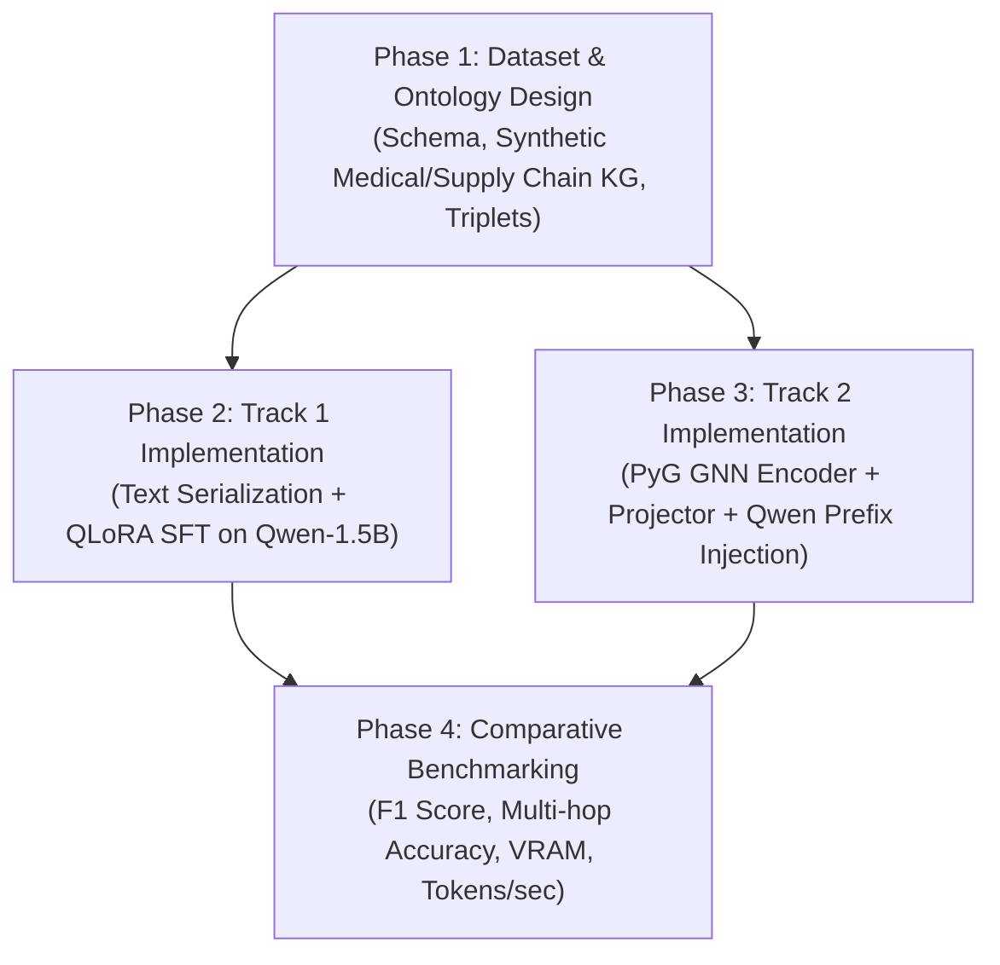

# 🔬 Benchmark Specification: Pure LLM vs. Hybrid GNN+LLM for Graphs & Ontologies

## 1. Executive Summary & Objective
The goal of this benchmark project is to provide a rigorous, empirical head-to-head comparison between two fundamentally competing paradigms in modern Graph AI:
- **Track 1: Pure LLM Fine-Tuning (Language-Native Serialization)**: Transforming graph topology and ontology schemas into text sequences (Triples, Turtle/RDF, ChatML) and fine-tuning an autoregressive transformer (`Qwen2.5-1.5B-Instruct`) via QLoRA + SFT.
- **Track 2: Hybrid GNN + LLM Multimodal Architecture (Structural Token Projection)**: Encoding the underlying non-Euclidean graph using a Graph Neural Network (GCN/GAT in `torch_geometric`) and projecting the continuous node/graph embeddings into the LLM's embedding space as "virtual graph prefix tokens".

Both tracks are evaluated on the exact same dataset splits across three core graph tasks to answer:
1. When is pure language serialization sufficient?
2. When does explicit topological message-passing (GNN) provide a measurable accuracy or memory advantage?

---

## 2. Benchmark Tasks & Evaluation Metrics

```
                     ┌────────────────────────────────────────────────────────┐
                     │              COMMON BENCHMARK DATASET                  │
                     │  (Biomedical / Enterprise Domain Knowledge Graph)      │
                     └───────────────────────────┬────────────────────────────┘
                                                 │
         ┌───────────────────────────────────────┼───────────────────────────────────────┐
         ▼                                       ▼                                       ▼
  [ Task A: Triplet IE ]               [ Task B: Multi-Hop QA ]              [ Task C: Link Prediction ]
  Text → (Head, Rel, Tail)             Graph Path → Inferred Fact            Graph - Edge → Missing Rel
  • Metric: Exact Match & Macro F1     • Metric: Multi-Hop Deduction Acc     • Metric: Hits@1, Hits@3, MRR
```

### Task A: Information Extraction to Ontology Triples
- **Input**: Unstructured domain sentence (e.g. clinical or e-commerce supply chain description).
- **Target**: Set of verified triples `[(Subject, Predicate, Object), ...]` strictly conforming to the ontology schema.
- **Metrics**: Precision, Recall, Macro F1 on extracted relations and entity boundaries.

### Task B: Multi-Hop Topological Reasoning
- **Input**: Subgraph context + Question requiring 2-hop to 3-hop transitive deduction.
- **Target**: The deductive target node or relationship.
- **Metrics**: Exact Match Accuracy, Hallucination Rate.

### Task C: Inductive Link Prediction
- **Input**: Subgraph topology with a masked target edge $(u, ?, v)$.
- **Target**: Predicting the valid ontological relation or confirming edge validity.
- **Metrics**: Hits@1, Mean Reciprocal Rank (MRR).

---

## 3. Architectural Specifications

### Track 1: Pure LLM (Language-Native)
- **Base Model**: `Qwen/Qwen2.5-1.5B-Instruct`
- **Adapter**: PEFT LoRA ($r=16, \alpha=32$, all linear projection layers)
- **Quantization**: 4-bit NormalFloat (NF4) via `bitsandbytes`
- **Input Encoding**: Text serialization format:
  ```text
  [ONTOLOGY SCHEMA] Classes: {Drug, Disease, Gene}. Relations: {TREATS, CAUSES, INHIBITS}
  [GRAPH CONTEXT] (Metformin)-[:TREATS]->(Type2Diabetes). (Type2Diabetes)-[:ASSOCIATED_WITH]->(CardiovascularRisk).
  [QUERY] What indirect risk does Metformin target?
  ```

### Track 2: Hybrid GNN + LLM (Multimodal Token Injection)
- **Graph Encoder**: 2-layer Graph Convolutional Network (GCN) or Graph Attention Network (GAT) built with `torch_geometric`.
- **Node Feature Dim**: $d_{\text{graph}} = 128$
- **Multimodal Projector**: 2-layer MLP with GELU:
  $$\mathbf{W}_{\text{proj}}: \mathbb{R}^{d_{\text{graph}}} \rightarrow \mathbb{R}^{d_{\text{llm}}}$$
  (Where $d_{\text{llm}} = 1536$ for Qwen-2.5-1.5B).
- **LLM Backbone**: `Qwen/Qwen2.5-1.5B-Instruct` (frozen weights or low-rank LoRA adapter).
- **Mechanism**: The projected graph embeddings are prepended to the input sequence as virtual prefix tokens:
  $$\mathbf{H}_{\text{input}} = \big[ \mathbf{z}_{\text{node}_1}, \mathbf{z}_{\text{node}_2}, \dots, \mathbf{z}_{\text{node}_K}, \mathbf{e}_{\text{tok}_1}, \dots, \mathbf{e}_{\text{tok}_M} \big]$$

---

## 4. Hardware Budget & Resource Footprint

Both tracks are designed to execute within a standard **Google Colab Free/Pro T4 GPU (16GB VRAM)**:

| Resource Metric | Track 1: Pure LLM (QLoRA) | Track 2: Hybrid GNN + LLM | Target Constraint |
|---|---|---|---|
| **Base Model VRAM** | ~1.1 GB (4-bit NF4) | ~1.1 GB (4-bit NF4) | $\le 16$ GB |
| **Graph / Encoder VRAM**| 0 MB (Text tokens) | ~150 MB (PyG GNN + Graph) | $\le 1$ GB |
| **Adapter / Projector** | ~70 MB (LoRA adapter) | ~30 MB (MLP Projector) + LoRA | $\le 200$ MB |
| **Peak Training VRAM**  | ~3.8 GB – 4.5 GB | ~4.2 GB – 5.2 GB | $\le 12$ GB (Headroom safe) |

---

## 5. Repository Layout (`llm-graph-ontology/`)

```
llm-graph-ontology/
├── README.md                          # Master benchmark report & findings
├── configs/
│   ├── track1_pure_llm.yaml           # QLoRA text training configuration
│   └── track2_gnn_llm.yaml            # PyG GNN + Projector alignment config
├── data/
│   ├── ontology_schema.json           # Formal ontology definition (Entities, Relations, Constraints)
│   ├── train_triples.jsonl            # Graph splits with paired text
│   ├── val_triples.jsonl
│   └── test_triples.jsonl
├── src/
│   ├── data/
│   │   ├── graph_dataset_generator.py # Synthetic domain KG generator (anti-leakage)
│   │   └── graph_serializer.py        # Text verbalizer (Turtle, RDF, ChatML)
│   ├── models/
│   │   ├── gnn_encoder.py             # PyTorch Geometric GCN/GAT encoder
│   │   └── graph_projector.py         # MLP alignment layer (GNN dim -> LLM dim)
│   ├── training/
│   │   ├── train_track1_pure_llm.py   # Standard TRL SFTTrainer pipeline
│   │   └── train_track2_gnn_llm.py    # Joint GNN Projector + LoRA training loop
│   └── evaluation/
│       ├── evaluator.py               # Evaluates F1, Multi-hop, and Link Prediction
│       └── comparative_benchmark.py   # Side-by-side performance & latency comparison
├── notebooks/
│   ├── 01_data_and_ontology_setup.ipynb
│   ├── 02_track1_pure_llm_finetuning.ipynb
│   ├── 03_track2_gnn_llm_fusion.ipynb
│   └── 04_head_to_head_comparison.ipynb
└── reports/
    └── comparative_benchmark_report.md
```

---

## 6. Implementation Phases


